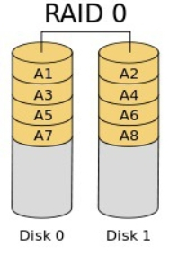
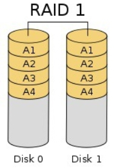
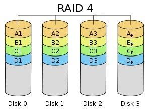
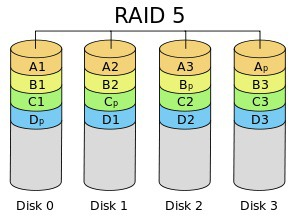
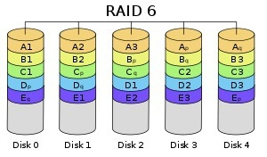

# RAID의 정의와 종류
RAID란 Redundant Array of Indefendent Disks의 약자로
데이터의 안정성 혹은 높은 성을을 위해 여러 개의 물리적 보조기억장치를 마치 하나의
논리적 보조기억장치처럼 사용하는 기술을 말한다.
RAID의 구성 방법에는 여러 종류가 있는데 방법에 따라 RAID level이라고 표현한다.
대표적인 RAID level인 RAID0, RAID4, RAID5, RAID6에 대해 알아보자.

### 1. RAID0

    여러 개의 보조기억장치에 데이터를 단순히 나누어 저장하는 구성 방식이다.
    저장되는 데이터가 하드 디스크 개수만큼 나뉘어 저장된다.
    이때 줄무늬처럼 분산되어 저장되는 데이터를 stripe 이라 하고,
    분산하여 저장하는 것을 striping 이라고 한다.

    이런 방식으로 저장하게되면 cpu의 속도에 비해 느린 하드디스크의 전송속도를
    각 하드디스크가 나뉘어 부담하기 떄문에 읽고 쓰는 속도가 빨라진다.

    하지만, 큰 단점이 있다. 하나의 하드디스크가 훼손되면 모든 디스크의 정보를
    읽는데 문제가 생길 수 있다. 이를 보완하기 위해 RAID1이 탄생했다.

### 2. RAID1

    복사본을 만드는 방식이다.
    완전히 같은 데이터를 두개의 보조기억장치에 나누어 저장하기에 미러링 이라고도 부른다.
    어떠한 데이터를 쓸때 원본과 복사본 두가지를 저장하기떄문에 쓰기 속도가
    현저히 느리고, 데스크 개수가 한정되었을 때 사용 가능한 용량이 적어지는 단점이 있다.
    
    하지만 복구가 매우 간단하다는 장점이 있다.

### 3. RAID4

    RAID4는 RAID1처럼 완전한 복사본을 만드는 대신 오류를 검출하고 복구하기 위한 정보를
    담는 패리티비트를 특정 디스크에 저장한다.
    RAID4 에서는 패리티를 저장한 장치를 이용해 다른 장치들의 오류를 검출하고, 
    오류가 있다면 복구까지 시도한다. 이로써 RAID1 보다 적은 보조기억장치로
    데이터를 안전하게 보관할 수 있다.

    본래 패리티비트는 오류 검출만을 하는 비트이다.
    하지만 RAID에서는 패리티계산법을 통해 오류 수정도 가능하다.

### 4. RAID5

    
    RAID4에서는 새로운 데이터가 저장될 때마다 패리티를 저장하는 디스크에도 데이터를 쓰게
    되므로 패리티를 저장하는 장치에 병목현상이 발생하게 된다.
    이를 해결하기위해 RAID5 방식은 모든 보조기억장치에 패리티를 분산하여 저장한다.

### 5. RAID6

    RAID6는 기존 RAID5 방식을 보완한 방식으로
    하나의 데이터가 저장될때 두개의 패리티 비트를 생성하여
    두개의 보조기억장치에 나누어 저장하는 방식이다.
    이로써, 두개의 패리티 비트를 통해 보다 안전하게 오류를 검출하고 복구할 수 있지만,
    RAID5 방식보다 쓰기 속도가 느리고, 사용 가능한 용량이 작다.

    데이터를 더욱 안전하게 보관하고 싶을때 사용하는 방식이다.

이 밖에 RAID0과 RAID1을 혼합한 RAID10방식, RAID5와 RAID0을 혼합한 RAID50방식이 있다.