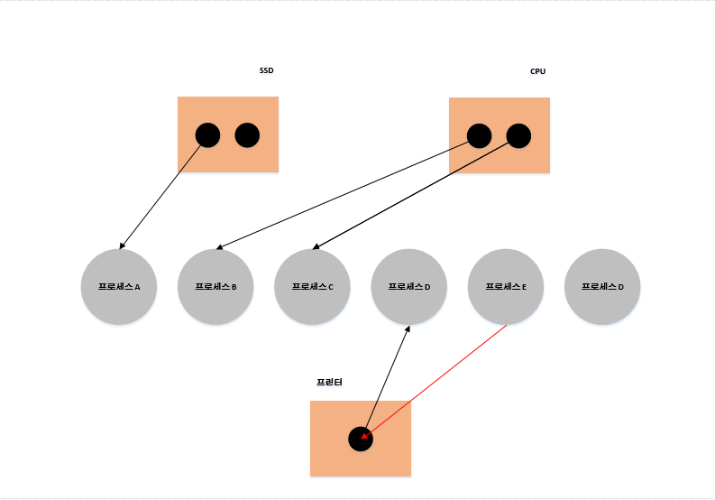

# 교착 상태란?
프로세스를 실행하기 위해서는 자원이 필요한데, 두 개 이상의 프로세스가 각자 가지고 있는
자원을 무작정 기다린다면 그 어떤 프로세스도 더 이상 진행할 수 없는 교착 상태가 된다.

교착 상태는 다양한 상황에서 발생한다. 앞서 배운 뮤텍스 락으로 예시를 들어보겠다.
프로세스 A는 임계 구역 진입 전 lock1을 잠그고 프로세스 B는 lock2를 잠군 상황이다.
만일 프로세스 A는 lock2가 false 되길 기다리고 프로세스 B는 lock1이 false 되길
기다린다면, 교착상태가 발생하게 된다.

이러한 교착 상태를 해결하기 위해서는 교착상태가 발생했을 때의 상황을 정확히 표현하고
교착상태가 일어나는 근본적인 원인을 파악해야한다.

### 1. 자원 할당 그래프
    자원 할당 그래프는 어떤 프로세스가 어떤 자원을 사용하고 있는지, 어떤 프로세스가
    어떤 자원을 기다리고 있는지 도식화 하여 표현하는 간단한 그래프이다.
    이를 통해 교착상태를 단순하게 표현할 수 있다.
    그려지는 규칙은 다음과 같다
    1. 프로세스는 원, 자원의 종류는 사각형으로 표현한다
    2. 사용할 수 있는 자원의 개수는 자원 사각형 내에 점으로 표현한다.
    3. 프로세스가 자원을 할당받아 사용 중이라면 자원에서 프로세스를 향해 화살표를 표기한다.
    4. 프로세스가 어떤 자원을 기다리고 있다면 프로세스에서 자원으로 화살표를 표기한다.

    위 처럼 표현하며, 보통 교착상태가 일어난 상태의 그래프는 원의 형태를 띈다.

### 2. 교착 상태 발생 조건
    교착 상태가 발생하는 조건에는 아래 네가지가 있다.
    즉, 아래 조건 중 하나라도 만족하지 않는다면 교착 상태가 발생하지 않지만,
    아래 조건이 모두 만족될 때 교착 상태가 발생할 가능성이 생긴다.

    1. 상호배제
    한 프로세스가 사용하는 자원을 다른 프로세스가 사용할 수 없을 경우
    2. 점유와 대기
    어떠한 자원을 할당받은 상태에서 다른 자원을 할당받기를 기다린 경우
    3. 비선점
    어떤 프로세스도 다른 프로세스의 자원을 강제로 빼앗지 못하는 경우
    4. 원형대기
    프로세스들과 프로세스가 요청 및 할당받은 자원이 원의 형태를 이루는 경우
    다시 말해 자원 할당 그래프가 원의 형태로 그려지는 경우